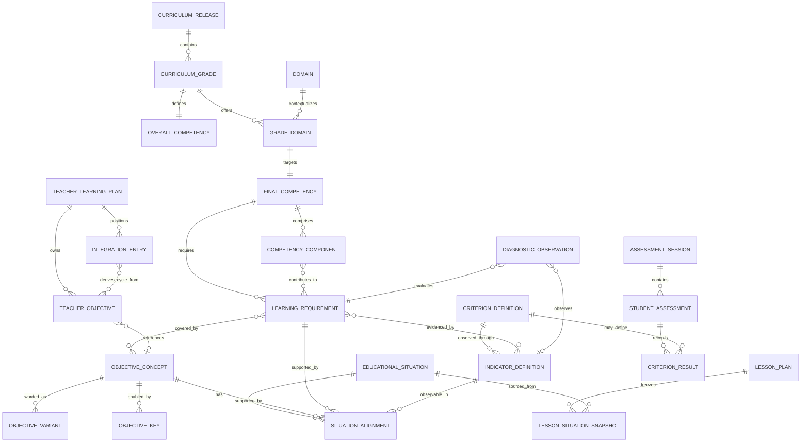

# ArenaSPEX Pedagogical Knowledge Core Design

## 1. Executive summary

ArenaSPEX should add a pedagogical knowledge core without replacing its current planning and execution architecture. The least disruptive design is a hybrid model:

- Store authoritative and reviewed pedagogical knowledge in an immutable, versioned catalog with stable identifiers.
- Keep the Teacher Learning Plan in its existing `AnnualPlan(kind = teacher_learning_plan)` JSON document, adding only optional semantic references in a later implementation.
- Keep current operational records such as `ClassPlannedSession`, `LessonPlan`, `AssessmentSession`, and snapshots unchanged.
- Add relational tables only for mutable, query-heavy, governed relationships, especially situation alignment and future diagnostic observations.
- Implement competency coverage as a pure set-based domain service. It must not define completeness from lesson, objective, or week counts.

The repository already contains most of the operational backbone. The missing part is a canonical semantic layer that distinguishes a competency's meaning from a teacher's wording and connects both to learning requirements, situations, and observable indicators.

No current table or route should be renamed. No runtime behavior should switch until a versioned Domain 1 pilot has been validated against existing teacher data.

## 2. Source classification and authority

The reference document deliberately mixes four categories. The future catalog must preserve them explicitly rather than flattening them into one notion of truth.

| Category | Meaning in the reference | Architectural treatment |
|---|---|---|
| Official or source-derived knowledge | Curriculum grades, overall competencies, domains, final competencies, documented components, resources, criteria, indicators, and progression statements | Immutable versioned catalog entries with source citations and review state |
| Platform pedagogical decision | No standalone remediation lesson; continuous assessment remains authoritative; flexible objective count; diagnostic and summative are competency-wide; integration covers the preceding cycle | Versioned policy records or code rules identified as platform decisions, never mislabeled as official quotations |
| Reviewed derived design | Learning requirements, objective concepts, objective variants, objective keys, coverage rules, situation eligibility, and alignment strength | Derived catalog entries that require pedagogical review before becoming active |
| Unresolved or unverified | Complete requirement lists, full objective bank, equivalence between variants, complete criterion and indicator mapping, alignment weights, and governance overrides | Draft-only records excluded from authoritative coverage decisions |

The reference document is a conceptual authority for this design, but its suggested entity names are not mandatory database table names.

## 3. Current architecture audit

### 3.1 Reference knowledge

The repository currently distributes curriculum knowledge across three static sources:

- `src/data/algerianCurriculum.ts` contains grades, domains, final competencies, criteria, indicators, sessions, session types, and objective text.
- `src/data/annualPlanReference.ts` contains overall competencies, final competencies, components, resources, and evaluation text used by the Annual Plan.
- `src/data/domainOneLearningSectionReference.ts` contains stable Domain 1 competency-component IDs, final-competency text, and Domain 1 pedagogical defaults for Grades 1–5.

These sources are useful and reusable, but they are not governed by one explicit curriculum release. Some concepts and wording are duplicated, and no canonical version registry establishes which value is authoritative when text differs.

### 3.2 Teacher planning

The current Teacher Learning Plan is stored in the `AnnualPlan` table as JSON with `kind = teacher_learning_plan`. It supports:

- Dynamic objective count and order.
- Stable teacher objective IDs.
- `sourceReferenceId` for objectives originating from the reference sequence.
- Optional competency-component IDs and enriched pedagogical fields.
- Teacher wording, notes, resources, situation snapshots, and integration placement.
- Diagnostic and summative special entries.
- Backward normalization and safe reference enrichment.

This model must remain the teacher-owned planning aggregate. The knowledge core should be referenced by it, not embedded into or mutated by every teacher plan.

### 3.3 Integration placement

`TeacherLearningIntegrationPoint.afterObjectiveId` locates each integration in the ordered objective sequence. Therefore the objectives belonging to an integration cycle can already be derived from the beginning of the section or the previous integration through the current integration anchor.

An explicit persisted `LearningCycle` entity is not currently necessary. Persisting a second representation of the same boundaries would create synchronization risk whenever an integration is moved.

### 3.4 Educational situations and snapshots

`EducationalSituation` is a relational model with moderation and ownership fields. It stores grade, domain, objective ID arrays, objective text arrays, organization, equipment, source goal, origin, and approval status.

The current selector performs exact matching against objective IDs or text. This is a partial alignment mechanism, but the arrays cannot represent:

- Alignment to learning requirements or indicators.
- Usage type such as diagnostic, learning, integration, summative, or adaptation.
- Relevance strength or pedagogical justification.
- Independent review and provenance for each relationship.

`EducationalSituationSnapshot` and the snapshot embedded in a `LessonPlanRow` correctly freeze the situation used in a historical teacher plan or lesson memo. This behavior must be preserved.

### 3.5 Assessment and Gradebook

The runtime assessment model already uses `AssessmentSession`, `StudentAssessment`, and `CriterionResult`. `CriterionResult.criterionId` is a contextual string generated from grade, domain, final competency, and one of `C1` to `C4`. There is no canonical curriculum criterion or indicator table.

The current Gradebook also stores its own continuous-assessment envelope and weighting logic. Therefore:

- A curriculum `CriterionDefinition` is not identical to `CriterionResult`.
- `CriterionResult` is a runtime observation/result that may later reference a canonical criterion.
- The Smart Gradebook must remain unchanged and may consume semantic links later without changing its scoring contract.

### 3.6 Existing coverage service

`knowledgeCoverage.service.ts` reports counts of games, objectives, remediation items, and situations. It does not calculate semantic competency coverage. The new Coverage Engine should therefore use a separate contract and name to avoid treating resource counts as proof of pedagogical completeness.

### 3.7 Versioning

There is no standalone `CurriculumVersion` model. Version numbers currently belong to individual JSON contracts or generators. Historical stability is provided mainly by persisted JSON and situation snapshots, not by a versioned curriculum graph.

## 4. Three-layer knowledge model

### Layer 1: Curriculum and reference knowledge

This layer is immutable for teachers and scoped to a curriculum release:

`CurriculumRelease -> CurriculumGrade -> GradeDomain -> FinalCompetency -> CompetencyComponent / LearningRequirement -> Resource / Criterion -> Indicator`

The overall competency belongs to the grade context. A final competency belongs to one grade-domain context. Components and requirements belong to the final competency.

### Layer 2: Applied pedagogical knowledge

This layer translates official meaning into teachable concepts:

`ObjectiveConcept -> ObjectiveVariant / ObjectiveKey`

`ObjectiveConcept <-> LearningRequirement`

Objective concepts are reviewed derived knowledge unless a source explicitly defines them. Objective variants express the same concept in different valid wording. Objective count is never part of concept identity.

### Layer 3: Execution knowledge

This layer connects semantic meaning to actual work:

`TeacherObjective -> ObjectiveConcept`

`EducationalSituation -> SituationAlignment -> ObjectiveConcept / LearningRequirement / Indicator`

`LessonPlan -> LessonSituationSnapshot`

`DiagnosticObservation -> LearningRequirement / Indicator`

Existing teacher planning, scheduling, lesson generation, and assessment records remain operational aggregates rather than becoming curriculum definitions.

## 5. Entity definitions and storage disposition

| Concept | Definition | Recommended disposition |
|---|---|---|
| CurriculumRelease | An approved edition of the pedagogical reference and platform interpretation package | Versioned catalog manifest |
| CurriculumGrade | Grade context carrying the overall competency | Versioned catalog |
| Domain | Stable identity of one of the three PE domains | Versioned catalog, preserving current field IDs |
| GradeDomain | Versioned grade-domain context | Catalog bridge, not necessarily a database table |
| OverallCompetency | Broad competency for a grade | Versioned catalog |
| FinalCompetency | Target competency for one grade-domain context | Versioned catalog |
| CompetencyComponent | Official component contributing to a final competency | Versioned catalog; preserve existing Domain 1 IDs |
| LearningRequirement | Stable essential meaning unit whose coverage is required | Reviewed derived catalog entry |
| ResourceDefinition | Canonical knowledge, methodological, motor/sensory, value, or transversal resource | Structured catalog value; avoid duplicating equipment |
| CriterionDefinition | Curriculum-level dimension for judging performance | Versioned catalog definition |
| IndicatorDefinition | Observable evidence linked to a criterion and requirements | Versioned catalog definition |
| ObjectiveConcept | Stable teachable meaning covering one or more requirements | Reviewed derived catalog entry |
| ObjectiveVariant | One approved wording of an ObjectiveConcept | Versioned catalog entry |
| ObjectiveKey | Practical, technical, or methodological success key | Versioned catalog entry |
| TeacherObjective | Teacher-owned objective instance with wording, order, notes, and selected situations | Existing Teacher Learning Plan JSON |
| IntegrationEntry | Teacher-positioned integration point | Existing Teacher Learning Plan JSON |
| EducationalSituation | Canonical or teacher-owned activity in the moderated bank | Existing Prisma model |
| SituationAlignment | Governed many-to-many semantic relationship with usage metadata | Future additive Prisma model |
| LearningCycle | Objectives since the previous integration or section start | Derived read model, not persisted initially |
| DiagnosticObservation | Student or group state against a requirement or indicator at diagnosis | Future additive runtime Prisma model |
| LessonSituationSnapshot | Frozen copy of the situation actually used | Existing JSON snapshot; retain |

## 6. ER relationship diagram



## 7. Cardinality decisions

| Relationship | Cardinality | Decision and justification |
|---|---:|---|
| CurriculumRelease to CurriculumGrade | 1:N | Grade records are scoped to a release so old releases remain resolvable |
| CurriculumGrade to OverallCompetency | 1:1 per release | One overall competency frames each grade in the current curriculum |
| CurriculumGrade to Domain | N:M through GradeDomain | Three stable domain identities recur across grades with grade-specific meaning |
| Domain to FinalCompetency | 1:N across grades | Each domain has one grade-specific final competency per GradeDomain |
| GradeDomain to FinalCompetency | 1:1 | The final competency is specific to that grade-domain context |
| FinalCompetency to CompetencyComponent | 1:N | Components are constituent parts of one final competency |
| FinalCompetency to LearningRequirement | 1:N | Requirements define the complete required set for that competency |
| CompetencyComponent to LearningRequirement | N:M | One requirement can combine cognitive, methodological, and value components; a component can contribute to several requirements |
| LearningRequirement to ObjectiveConcept | N:M | An objective may cover several related requirements and a requirement may be reinforced by several concepts |
| ObjectiveConcept to ObjectiveVariant | 1:N | Several wordings can preserve one meaning |
| ObjectiveConcept to ObjectiveKey | 1:N | A concept may require several practical or methodological keys |
| ObjectiveConcept to EducationalSituation | N:M | One situation can serve several objectives and each objective can use several situations |
| LearningRequirement to EducationalSituation | N:M | Situations may cover multiple requirements and requirements need multiple eligible situations |
| CriterionDefinition to IndicatorDefinition | 1:N | Indicators operationalize one criterion; cross-criterion evidence should be expressed by requirement links rather than ambiguous ownership |
| LearningRequirement to IndicatorDefinition | N:M | One observation can evidence more than one requirement and each requirement needs several indicators |
| TeacherObjective to ObjectiveConcept | N:0..1 | Pattern C is recommended: teacher wording remains local with an optional semantic reference |
| TeacherObjective to CompetencyComponent | N:M | Preserve current direct component IDs for compatibility; later validate or derive them from requirements |
| IntegrationEntry to TeacherObjective | N:M derived | The set is calculated from order and integration anchors, not stored twice |
| EducationalSituation to SituationAlignment | 1:N | Each governed link carries independent usage and justification metadata |
| LessonPlan to LessonSituationSnapshot | 1:N | A lesson may use several situations; each historical snapshot belongs to one lesson use |

## 8. Current-data mapping

| Conceptual entity | Current model, type, file, or field | Status |
|---|---|---|
| CurriculumRelease | Scattered `version` literals; no curriculum release registry | Missing |
| CurriculumGrade | `PE_LEVELS`, `COMPLETE_ANNUAL_CURRICULUM`, `AnnualPlanLevel` | Already exists as static reference |
| OverallCompetency | `annualPlanReference.ts` comprehensive competency | Partial; duplicated and not version-scoped |
| Domain | `PE_FIELDS`, `CurriculumFieldDetail.fieldId`, stable `f_*` IDs | Already exists |
| FinalCompetency | `FinalCompetency` type, curriculum files, `TeacherLearningPlanDomain.finalCompetencyId` | Partial; multiple sources can diverge |
| CompetencyComponent | `domainOneLearningSectionReference.ts`, `competencyComponentIds` | Partial and reusable; Domain 1 only |
| LearningRequirement | No equivalent stable semantic unit | Missing |
| ResourceDefinition | `learningContent`, `pedagogicalKnowledge`, `executionContent`, `resources`, Annual Plan knowledge/transversal text | Partial and implicit |
| CriterionDefinition | Curriculum `criteria` arrays and Annual Plan evaluation text | Partial; no canonical identity |
| IndicatorDefinition | Curriculum `indicators` arrays | Partial; no canonical identity |
| ObjectiveConcept | Session objectives and knowledge objective items | Implicit; wording currently acts as meaning |
| ObjectiveVariant | Teacher wording plus `sourceReferenceId` | Implicit and incomplete |
| ObjectiveKey | No structured equivalent | Missing |
| TeacherObjective | `TeacherLearningObjective` in Teacher Learning Plan JSON | Already exists |
| IntegrationEntry | `TeacherLearningIntegrationPoint` with `afterObjectiveId` | Already exists |
| LearningCycle | Derivable from ordered objectives and integration anchors | Implicit; should remain derived |
| EducationalSituation | Prisma `EducationalSituation`, seed JSON, moderation routes | Already exists |
| SituationAlignment | `objectiveIds` and `objectiveTexts` arrays | Partial; lacks relationship metadata and integrity |
| SituationIndicator | No current relationship | Missing |
| LessonSituationSnapshot | `EducationalSituationSnapshot` in plan and lesson rows | Already exists |
| DiagnosticObservation | No requirement- or indicator-level diagnostic record | Missing |
| Runtime assessment | `AssessmentSession`, `StudentAssessment`, `CriterionResult` | Already exists operationally |
| Semantic Coverage Engine | `knowledgeCoverage.service.ts` only counts resources | Missing; existing service is not semantic coverage |

## 9. Ownership and immutability matrix

| Entity | Owner | Teacher editable | Inspector editable | Admin editable | Versioned | Historical freeze | Runtime snapshot |
|---|---|---:|---:|---:|---:|---:|---:|
| OverallCompetency | Official curriculum | No | No | Governance import only | Yes | Yes | Text/ID in historical documents when needed |
| FinalCompetency | Official curriculum | No | No | Governance import only | Yes | Yes | Yes |
| CompetencyComponent | Official curriculum | No; association only | No | Governance import only | Yes | Yes | ID/text snapshot where printed |
| LearningRequirement | Reviewed pedagogical core | No | Review/propose only | Approve through governance | Yes | Yes | IDs retained in generated artifacts |
| ResourceDefinition | Official or reviewed core | No; local additions remain plan data | Review/propose | Approve | Yes | When referenced historically | Optional |
| CriterionDefinition | Official or reviewed core | No | Review/propose | Approve | Yes | Yes | Link from runtime result |
| IndicatorDefinition | Official or reviewed core | No | Review/propose | Approve | Yes | Yes | Link from observation |
| ObjectiveConcept | Reviewed pedagogical core | No | Review/propose | Approve | Yes | Yes | Reference ID retained |
| ObjectiveVariant | Reviewed core or teacher-local wording | Select or author local wording | Review platform variants | Approve platform variants | Platform variants yes | Teacher wording preserved in plan | Yes |
| ObjectiveKey | Reviewed pedagogical core | No | Review/propose | Approve | Yes | Yes | Optional |
| TeacherObjective | Teacher | Yes | Suggest/read within assignment scope | Administrative support only | Plan contract version | Yes in saved plan | Yes |
| EducationalSituation | Platform bank or teacher | Owner edits private records | Moderate according to current workflow | Govern | Record revision, not curriculum version | Existing lesson use frozen | Yes |
| SituationAlignment | Platform governance or teacher-private relation | Private proposal only | Review/propose | Approve shared alignment | Yes or revisioned | Yes for historical resolution | Alignment IDs in snapshot optional |
| IntegrationCycle | Derived from Teacher Plan | Through objective order/integration movement | No direct edit | No direct edit | Follows plan version | Derivable from saved plan | No separate snapshot needed |
| DiagnosticObservation | Teacher runtime data | Yes for owned class/student | Read within accepted assignment scope | Govern access only | No curriculum version; stores referenced release | Yes | It is already a runtime record |
| LessonSituationSnapshot | Teacher lesson artifact | Only through explicit lesson editing | Read/review in scope | No routine edit | Carries source version metadata | Yes, mandatory | It is the snapshot |

## 10. Versioning strategy

### 10.1 Release boundary

Create a `CurriculumRelease` manifest for a complete approved knowledge catalog. A release should include:

- Release ID and semantic version.
- Effective academic years if applicable.
- Source documents and source locations.
- Review and approval metadata.
- Content hash.
- Status: draft, reviewed, active, deprecated, or superseded.

### 10.2 Stable identity

Semantic IDs remain stable when wording changes without changing meaning. A new identity is required when the pedagogical meaning changes. Every record also carries a release or revision reference so historical text remains reproducible.

Preserve current IDs wherever possible:

- Grade IDs such as `lvl_p1`.
- Domain IDs such as `f_locomotion`.
- Existing Domain 1 component IDs such as `learning-section:lvl_p1:f_locomotion:component:1`.
- Existing teacher objective IDs and `sourceReferenceId` values.

An alias manifest should reconcile duplicate historical IDs rather than rewriting saved teacher plans.

### 10.3 Historical resolution

- Existing teacher plans without core references continue to load unchanged.
- New optional references should include `coreReleaseId`, `objectiveConceptId`, and optionally `objectiveVariantId`.
- Lesson plans continue to freeze displayed text and situation snapshots, while retaining source IDs and release IDs for audit.
- Deprecated knowledge remains readable and is excluded only from new suggestions.
- Supersession never mutates an old plan automatically.

## 11. Provenance strategy

Use a small provenance object on every catalog or governed alignment record:

```text
originType: official_source | platform_decision | reviewed_derived | teacher_owned | unresolved
sourceRef: document/release/page-or-slide when available
reviewStatus: draft | reviewed | approved | deprecated
reviewedById: optional
reviewedAt: optional
supersedesId: optional
```

For a code-hosted catalog this metadata lives beside each entry or group. For relational alignment records the same fields are columns or a compact JSON metadata field. `unresolved` records must never participate in mandatory coverage validation.

## 12. Teacher-plan integration design

Use Pattern C:

`TeacherObjective stores teacher wording + optional ObjectiveConcept reference`.

This is less disruptive than replacing teacher objectives with variants and more semantically useful than linking directly to text.

Recommended future optional fields:

```text
coreReleaseId?: string
objectiveConceptId?: string
objectiveVariantId?: string
learningRequirementIds?: string[]  // derived/cache only, never sole authority
alignmentStatus?: mapped | teacher_custom | needs_review
```

Rules:

- Teacher wording, count, order, notes, situations, and integration positions remain teacher-owned.
- Editing wording does not automatically create a new ObjectiveConcept.
- If wording is changed but meaning remains, retain the concept link.
- If the teacher explicitly changes meaning, clear or revalidate the concept link.
- Custom unmapped objectives remain valid but appear in `unmappedObjectives` and cannot falsely satisfy coverage.
- Current `competencyComponentIds` remain supported as a compatibility and display association.

## 13. Coverage Engine design

The Coverage Engine is a pure domain service with no direct persistence side effects.

### Input

```text
coreReleaseId
gradeId
domainId
finalCompetencyId
teacherObjectives[] {
  teacherObjectiveId
  objectiveConceptId?
  explicitReviewedRequirementIds?
}
governanceOverride?  // future, explicit and audited only
```

### Output

```text
requiredRequirements[]
coveredRequirements[]
missingRequirements[]
reinforcementRequirements[]
unmappedObjectives[]
coverageStatus: complete | partial | unmapped | overridden
coveragePercentage?  // explanatory metric only
evidenceByRequirement
```

### Set semantics

Let `R` be the approved requirement set for the final competency. Let `C` be the union of approved requirements linked to mapped teacher objective concepts.

- Complete: `R ⊆ C` and no unresolved requirement blocks evaluation.
- Partial: `R - C` is non-empty.
- Reinforcement: a requirement is covered by more than one objective concept.
- Unmapped: one or more teacher objectives have no reviewed semantic mapping.
- Percentage: `|R ∩ C| / |R|`, shown only as supporting information.

Objective count, lesson count, week count, and A/B operational meetings do not enter the completeness formula.

## 14. Diagnostic design

Diagnostic assessment is scoped to the final competency and its approved requirements and indicators, not to one teacher objective.

Recommended future `DiagnosticObservation` fields:

```text
id
teacherId
classId
studentId?          // null for a group observation
assessmentSessionId
coreReleaseId
finalCompetencyId
learningRequirementId
indicatorId?
state: acquired | partial | not_acquired | needs_support
note?
observedAt
```

This should be a new runtime entity in a later phase because current assessment records cannot represent requirement-level starting states cleanly. It must reuse teacher ownership and inspector assignment scope. It should not modify Gradebook scoring.

## 15. Remediation design

Remediation remains an intervention inside a learning lesson, not a new lesson type. A future recommendation flow is:

`DiagnosticObservation -> missing requirement/indicator -> eligible remediation situation or adaptation -> selected TeacherObjective/session`.

Remediation metadata can be a `usageType = adaptation` or `remediation` on SituationAlignment plus a teacher-selected variation. No standalone remediation session or Annual Distribution row is introduced.

## 16. Integration-cycle design

Recommend derived-only cycles in the first implementation.

Algorithm:

1. Read ordered teacher objectives and ordered integration entries.
2. For each integration, collect objectives after the previous integration anchor and through the current `afterObjectiveId`.
3. Resolve the union of their objective concepts and learning requirements.
4. Select integration situations whose alignments cover that union without introducing new learning requirements.
5. Recalculate immediately when an integration moves.

A persisted cycle would duplicate information already represented by order and anchors. A hybrid snapshot is justified only when a generated historical lesson needs to preserve exactly which objectives were integrated; that belongs in the lesson artifact, not in the canonical Teacher Learning Plan.

## 17. Situation-alignment design

Keep one canonical `EducationalSituation` record. Add future governed alignment rows instead of duplicating situation text.

Conceptual `SituationAlignment` fields:

```text
id
situationId
coreReleaseId
objectiveConceptId?
learningRequirementId?
indicatorId?
usageType: learning | diagnostic | integration | summative | adaptation
relevance: primary | supporting
justification?
constraintsJson?
originType
reviewStatus
reviewedById?
reviewedAt?
```

At least one semantic target is required. A database constraint or application validator should prevent an empty alignment. Existing `objectiveIds` and `objectiveTexts` remain during dual-read and can later become compatibility fields after verified backfill.

Eligibility should filter by grade/domain and approved status in the database first, then score semantic coverage and practical constraints. A teacher may select another situation, but the system should clearly flag a mismatch rather than silently treating it as equivalent.

## 18. Summative-assessment design

Summative assessment is final-competency-wide. Eligibility resolves:

`FinalCompetency -> approved LearningRequirements -> CriterionDefinitions / IndicatorDefinitions -> eligible summative situations`.

The selected situation or set of situations must provide evidence for the required set. Runtime results continue to use `AssessmentSession`, `StudentAssessment`, and `CriterionResult`. Later, `CriterionResult` may reference canonical criterion and indicator IDs while retaining existing contextual IDs for compatibility.

The Smart Gradebook and its continuous-assessment weighting remain unchanged.

## 19. Storage strategy options

| Concern | Option A: relational core | Option B: versioned catalog only | Option C: hybrid |
|---|---|---|---|
| Migration risk | High: many new tables and backfills | Low | Low to medium, phased |
| Referential integrity | Strong | Validator-based | Strong where mutable relationships need it |
| Versioning | Complex row lifecycle | Natural immutable releases | Natural catalog releases plus relational release IDs |
| Coverage queries | Strong SQL but unnecessary for pure set logic | Fast in-memory for bounded catalog | Fast catalog calculation with queryable alignments |
| Situation search | Strong | Weak for mutable/moderated bank | Strong through relational alignments |
| Teacher-plan compatibility | Requires broad joins and migration | Excellent | Excellent |
| Domains 2/3 enrichment | Schema ready but data migration heavy | Easy catalog expansion | Easy catalog expansion |
| Governance | Strong but operationally heavy | Requires repository review workflow | Catalog approval plus existing DB moderation |
| Deployment risk | Highest | Lowest | Controlled and incremental |
| Maintainability | Risk of over-normalization | Risk of weak runtime relationships | Balanced |

## 20. Recommended storage architecture

Choose Option C, hybrid.

### Versioned catalog

Store official and reviewed derived knowledge in a versioned catalog validated at build/test time:

- CurriculumRelease manifest.
- Grade, domain, overall competency, final competency.
- Competency components and learning requirements.
- Resource definitions.
- Criterion and indicator definitions.
- Objective concepts, variants, and keys.
- Provenance and aliases.

This catalog may begin as typed JSON or TypeScript data because the corpus is bounded, reviewed, and released as a unit. It does not need one Prisma table per conceptual entity.

### Existing JSON aggregate

Keep Teacher Learning Plan persistence in `AnnualPlan.data`. Add optional semantic references only after the catalog pilot is stable. Do not convert every teacher objective into a relational row.

### Relational runtime and alignments

Use Prisma later for:

- SituationAlignment, because situations are mutable, moderated, and queried.
- DiagnosticObservation, because it is user-owned runtime data.
- Optional canonical reference columns on future assessment results.

## 21. Future migration sequence

### P0 foundational

- Freeze the current baseline and define the catalog schema and validator.
- Reconcile duplicate grade/domain/final-competency text across current files.
- Create a release manifest and alias map preserving current IDs.
- Build one reviewed Domain 1 Grade 1 catalog slice.
- Add pure read-only coverage tests; do not switch runtime reads.

### P1 applied knowledge

- Add reviewed LearningRequirements, ObjectiveConcepts, ObjectiveVariants, and ObjectiveKeys for the pilot.
- Add optional semantic references to Teacher Learning Plan validation while preserving old plans.
- Implement dual resolution: explicit concept link first, legacy `sourceReferenceId` second, unmapped otherwise.
- Expose coverage preview without blocking saves initially.

### P2 execution alignment

- Add an additive SituationAlignment migration.
- Backfill candidate alignments from existing objective IDs/texts as `reviewed_derived` drafts.
- Review and approve mappings.
- Dual-read existing arrays and new alignments.
- Verify selection parity before making alignments canonical.

### P3 runtime assessment

- Add DiagnosticObservation and optional canonical criterion/indicator references.
- Reuse existing teacher ownership and assignment authorization.
- Add diagnostic-to-remediation recommendations.
- Keep Gradebook calculation and current results untouched.

### Safe rollout pattern

For every phase: add -> backfill or derive -> dual-read -> verify -> switch canonical read -> deprecate later. No phase deletes existing data or rewrites historical plans.

## 22. API boundary proposal

No API is implemented by this report. Future boundaries should be:

| Boundary | Behavior | Authorization |
|---|---|---|
| Reference catalog read | Read active or specified release by grade/domain | Authenticated read-only; never mutates official knowledge |
| Teacher plan read/write | Extend existing `/api/teacher/learning-plan` contract with optional references | Teacher ownership; retain current validation |
| Coverage preview | Pure calculation for one owned plan; no mutation | Teacher owner; inspector read in accepted assignment scope |
| Situation eligibility | Database-filter approved/private-visible situations, then semantic ranking | Existing situation visibility and ownership rules |
| Alignment proposal | Create teacher-private or reviewer proposal | Teacher private scope; inspector/admin governance according to policy |
| Alignment approval | Approve shared semantic relationships | Admin or explicitly delegated pedagogical governance role |
| Diagnostic observations | CRUD for owned class/student observations | Teacher ownership; inspector read-only accepted-assignment scope |
| Governance release | Validate and activate a catalog release | Administrative release process; never exposed as ordinary CRUD |

All list endpoints must preserve database-level authorization filtering before pagination. Official curriculum mutations must never be available through teacher-plan routes.

## 23. Domain 1 compatibility example

Current Grade 1 Domain 1 data can be mapped without rewriting it:

```text
TeacherObjective
  id: teacher-objective:lvl_p1:f_locomotion:2
  wording: existing teacher wording
  sourceReferenceId: f_locomotion__2
  objectiveConceptId: future concept reference
        |
        v
ObjectiveConcept: adopt basic natural body positions on instruction
        |
        +--> LearningRequirement: recognize and execute basic body positions
        +--> LearningRequirement: transition safely according to a signal
        |
        v
CompetencyComponent:
  learning-section:lvl_p1:f_locomotion:component:1
        |
        v
FinalCompetency:
  Grade 1 / f_locomotion official final competency
```

Situation use remains separate:

```text
EducationalSituation
  -> SituationAlignment(usageType = learning)
  -> ObjectiveConcept and LearningRequirement
  -> selected in lesson
  -> EducationalSituationSnapshot frozen in LessonPlan
```

Grades 1–4 A/B operational meetings continue to resolve the same TeacherObjective identity and therefore the same semantic coverage. Grade 5 continues to use one operational meeting per objective. The core does not create or duplicate operational sessions.

## 24. Risks and open questions

### Compatibility risks

- Final-competency and criterion wording is duplicated across current reference files and can diverge.
- Existing situations use a mixture of legacy objective IDs and exact objective text.
- Existing teacher objectives may have custom wording or no safe semantic match.
- Replacing current IDs would break saved plans and situation selection; aliases are mandatory.

### Data-model risks

- Treating every conceptual entity as a Prisma table would over-normalize a bounded reference corpus.
- Storing semantic relationships only as string arrays would prevent integrity and relationship-level governance.
- Persisting LearningCycle boundaries would create a second source of truth beside integration anchors.
- A polymorphic alignment target without validation could create orphaned or contradictory links.

### Pedagogical risks

- Derived LearningRequirements or ObjectiveConcept equivalence could be incorrectly labeled official.
- A numeric coverage percentage could create false confidence if requirements are incomplete or unreviewed.
- Diagnostic and summative situations could be too narrow while still appearing fully mapped.
- Automated situation extraction from future memos could introduce duplicate or unreviewed content.

### Explicit unresolved decisions requiring product approval

1. The final reviewed LearningRequirement set for every final competency.
2. The authority and workflow that approve reviewed derived knowledge.
3. Whether inspectors may approve platform-wide derived knowledge or only propose it.
4. The complete ObjectiveConcept and ObjectiveVariant bank and the rule for semantic equivalence.
5. The canonical criterion and indicator map and its relationship to current `C1`–`C4` runtime identifiers.
6. Whether requirement coverage can be overridden, by whom, and what justification is mandatory.
7. Whether situation relevance needs only primary/supporting states or a reviewed numeric strength.
8. Whether diagnostic observations are per student, per group, or support both.
9. The release activation and deprecation workflow for curriculum catalog versions.
10. The policy for revalidating concept links after substantial teacher wording changes.
11. The minimum evidence required before imported memo situations become approved shared knowledge.

## 25. Recommended next implementation sprint

Implement P0 foundation only, without changing production behavior:

1. Define a typed, versioned catalog schema and provenance validator.
2. Create a reconciliation report for `algerianCurriculum.ts`, `annualPlanReference.ts`, and `domainOneLearningSectionReference.ts`.
3. Preserve current grade, domain, component, teacher-objective, and source-reference IDs through an alias manifest.
4. Encode and review only Grade 1 Domain 1 as the pilot release.
5. Implement the pure Coverage Engine contract against fixture data, but do not block teacher plan saves or change UI/API reads.
6. Prove that old Teacher Learning Plans, A/B execution, Grade 5 execution, Annual Distribution, Daily Notebook, Lesson Memo, situation snapshots, and Gradebook remain byte-for-byte or behaviorally compatible where applicable.

This sprint creates the semantic foundation and an evidence gate for later relational migrations. It does not require a Prisma migration.

## 26. Architecture decision record

- **Decision:** Use a hybrid knowledge core.
- **Reference storage:** Immutable versioned catalog.
- **Teacher planning storage:** Existing Teacher Learning Plan JSON aggregate.
- **Mutable semantic relationships:** Additive relational tables only when querying and governance require them.
- **Coverage:** Pure set-based calculation over approved LearningRequirements.
- **Teacher objective pattern:** Teacher wording plus optional ObjectiveConcept reference.
- **Competency-component identity:** Preserve existing Domain 1 stable IDs.
- **Learning cycle:** Derived from integration anchors; not persisted initially.
- **Situation history:** Preserve existing snapshots.
- **Assessment:** Link later; do not replace current continuous-assessment or Gradebook logic.
- **Immediate Prisma migration:** None.
